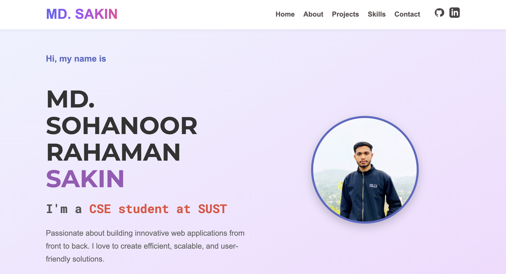
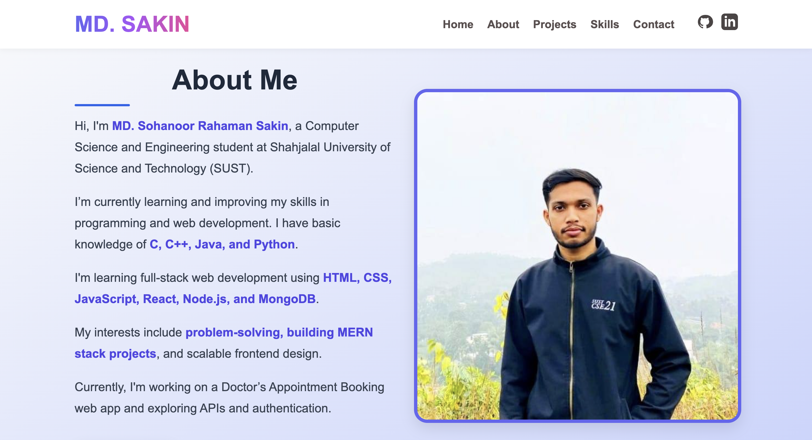
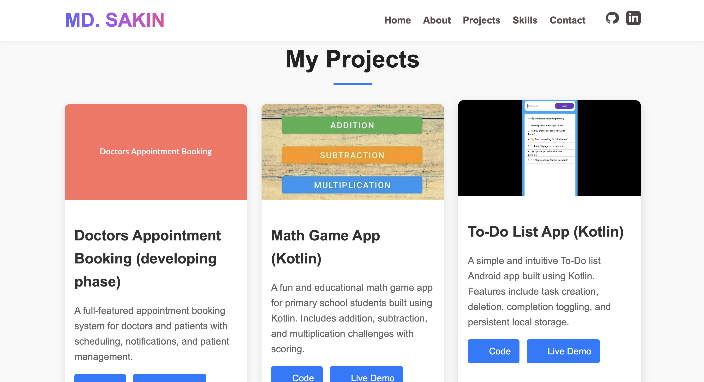
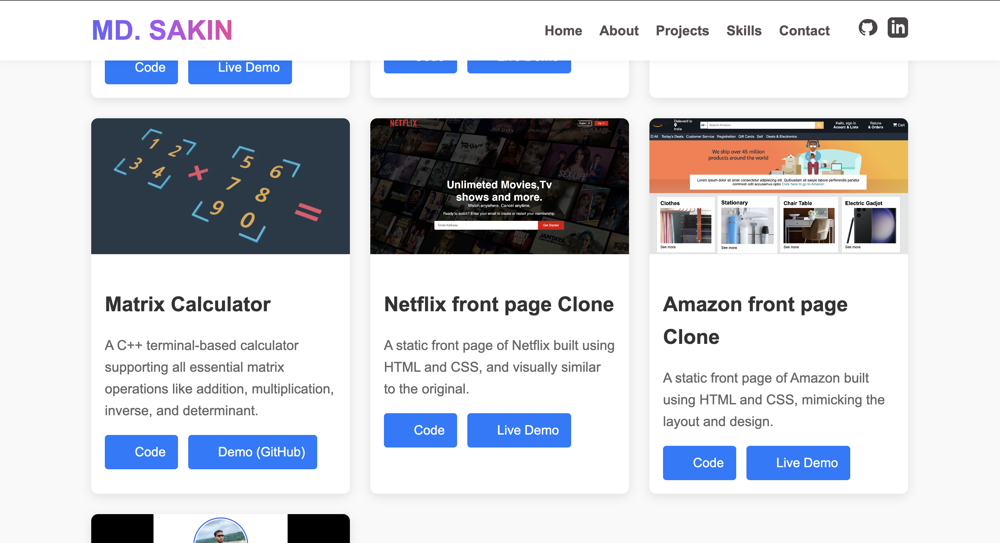
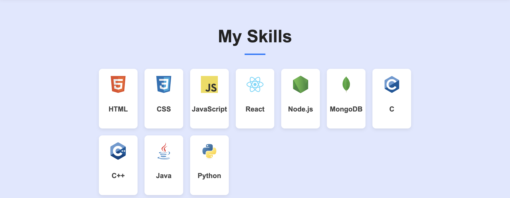
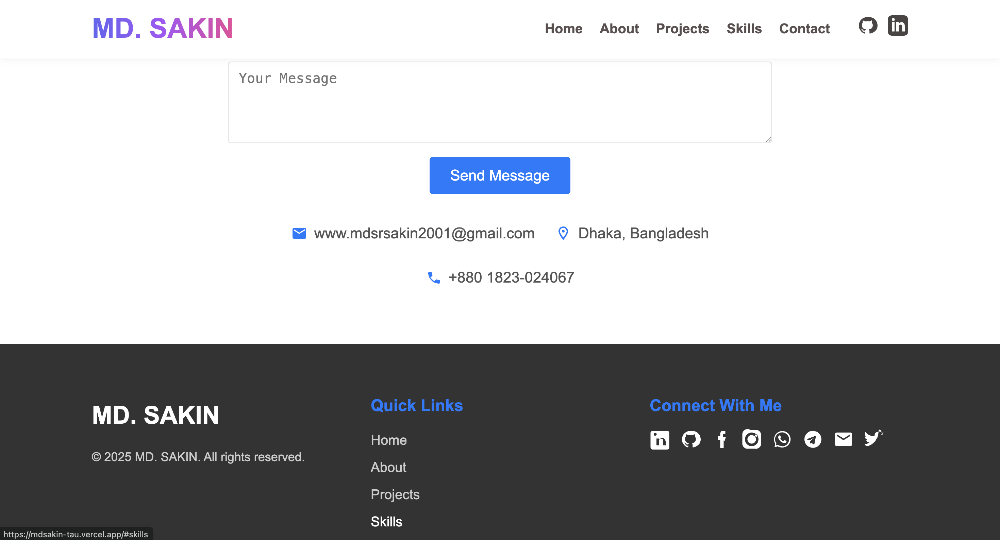

# 🧑‍💻 MD. SOHANOOR RAHAMAN SAKIN — Portfolio

Welcome to my personal portfolio website! This project showcases my skills, projects, and experiences as a Computer Science Engineering (CSE) student and aspiring full-stack developer.

## 🚀 Live Demo

👉 [Visit Portfolio](https://mdsakin-tau.vercel.app)  

---

## 🛠️ Tech Stack

- HTML5  
- CSS3  
- Responsive Design  
- Git & GitHub for version control  

---

## ✨ Features

- ✅ Clean and modern UI  
- ✅ Responsive design (mobile, tablet, desktop)  
- ✅ Project showcase section  
- ✅ About Me & Skills section  
- ✅ Contact form  
- ✅ Downloadable resume  

---

## 👨‍🎓 About Me

I’m **MD. SOHANOOR RAHAMAN SAKIN**, a 2nd-year CSE student at Shahjalal University of Science and Technology. Passionate about web development, problem-solving, and building impactful digital experiences.

---
## 📷 Screenshots

### 🏠 Home Page


### 👤 About Section


### 💻 Project 1


### 💻 Project 2


### 🧠 Skills Section


### 🔻 Footer



---
## 📌 How to Use

1. Clone the repository:
   ```bash
   git clone https://github.com/Sakin08/Portfolio_html_css.git
---

## 📬 Contact

- 📧 Email: [mdsrsakin2001@gmail.com](mailto:mdsrsakin2001@gmail.com)
- 🌐 GitHub: [github.com/sakin08](https://github.com/Sakin08)
- 💼 LinkedIn: [linkedin.com/in/mdsrsakin](https://www.linkedin.com/in/md-sohanoor-rahaman-sakin-7006b824b)

---

---


#### 📄 License
```markdown
## 📄 License

This project is licensed under the [MIT License](LICENSE).
